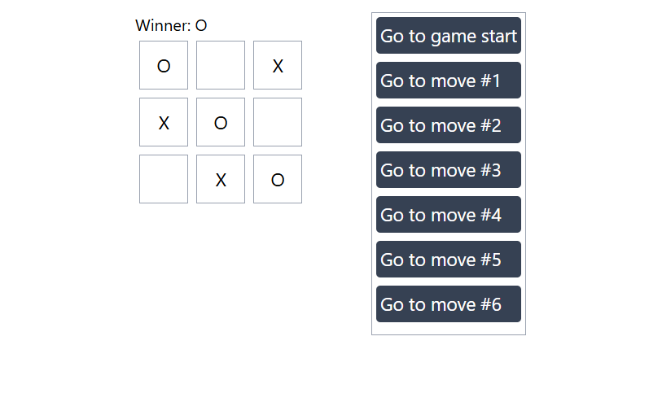

# Tic-Tac-Toe Game Development with React

এই Tutorial-এ আপনি একটি ছোট Tic-Tac-Toe Game তৈরি করবেন। এই Tutorial-টি এমনভাবে তৈরি করা হয়েছে যাতে React সম্পর্কে আগে থেকে কোনো জ্ঞান থাকার প্রয়োজন নেই। এখানে React-এর মূল ধারণাগুলো ধাপে ধাপে শেখানো হবে।

এই Tutorial-এ আপনি যেসব কৌশল শিখবেন, সেগুলো React-এর যেকোনো Application তৈরির মৌলিক ভিত্তি হিসেবে কাজ করবে। আপনি যদি এই অংশগুলো ভালোভাবে বুঝে নেন, তাহলে React-এর ভিতরের কাজগুলো সম্পর্কে একটি গভীর ধারণা অর্জন করতে পারবেন, যা ভবিষ্যতে বড় বা জটিল React Project তৈরি করতে সহায়তা করবে।



[Click Here to View The Game Live](https://tic-tac-toe-with-react-and-tailwind.vercel.app/)


এই Project টি কিভাবে Step by Step তৈরি করা যাবে, তা নিচে দেয়া হলোঃ

## 📚 Steps

1. [Project Setup]()
2. [Why We Need Pure Component](#2-why-we-need-pure-component)
3. [How Pure Component Works Internally](#3-how-pure-component-works-internally)
4. [Pure Component vs Regular Component](#4-pure-component-vs-regular-component)
5. [Example: Regular vs Pure Component](#5-example-regular-vs-pure-component)
6. [When to Use Pure Component](#6-when-to-use-pure-component)
7. [Limitations of Pure Component](#7-limitations-of-pure-component)
8. [Real-Life Examples](#8-real-life-examples)

# 1. Project Setup

1. Creating The Project With Vite
    - `npm create vite@latest my-project`
    - `cd my project`
2. Installing `tailwindcss` and `@tailwindcss/vite` via npm
    - `npm install tailwindcss @tailwindcss/vite`
3. Configuring the Vite plugin
    ```js
    import { defineConfig } from 'vite'
    import tailwindcss from '@tailwindcss/vite'

    export default defineConfig({
        plugins: [
        tailwindcss(),
        ],
    })
    ```
    এখানে `import tailwindcss from '@tailwindcss/vite'` এই লাইন এবং `plugins:[]` এর মধ্যে `tailwindcss()` অ্যাড করুন।
4. Importing Tailwind CSS
    - index.css ফাইলে যা আছে সব কেটে দিয়ে `@import "tailwindcss";` এইটা অ্যাড করুন। 
5. Run The Project
    - `npm run dev` এই Command টি দিয়ে Project টি Run করুন। 


