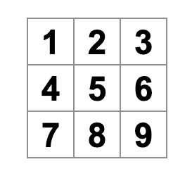
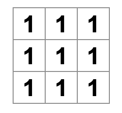
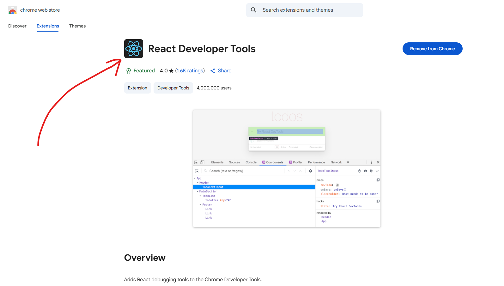
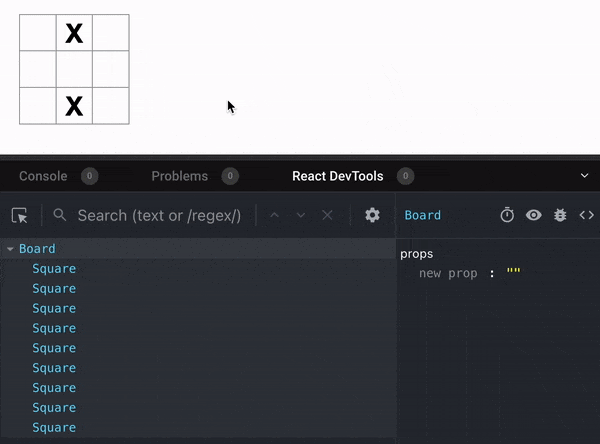
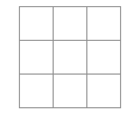

# Tic-Tac-Toe Game Development with React

এই Tutorial-এ আপনি একটি ছোট Tic-Tac-Toe Game তৈরি করবেন। এই Tutorial-টি এমনভাবে তৈরি করা হয়েছে যাতে React সম্পর্কে আগে থেকে কোনো জ্ঞান থাকার প্রয়োজন নেই। এখানে React-এর মূল ধারণাগুলো ধাপে ধাপে শেখানো হবে।

এই Tutorial-এ আপনি যেসব কৌশল শিখবেন, সেগুলো React-এর যেকোনো Application তৈরির মৌলিক ভিত্তি হিসেবে কাজ করবে। আপনি যদি এই অংশগুলো ভালোভাবে বুঝে নেন, তাহলে React-এর ভিতরের কাজগুলো সম্পর্কে একটি গভীর ধারণা অর্জন করতে পারবেন, যা ভবিষ্যতে বড় বা জটিল React Project তৈরি করতে সহায়তা করবে।


[Click Here to View The Game Live](https://tic-tac-toe-with-react-and-tailwind.vercel.app/)

এই Project টি কিভাবে Step by Step তৈরি করা যাবে, তা নিচে দেয়া হলোঃ

## 📚 Steps

1. [Project Setup](#1-project-setup)

## 1. Project Setup

1. Creating The Project With Vite
   - `npm create vite@latest my-project`
   - `cd my project`
2. Installing `tailwindcss` and `@tailwindcss/vite` via npm
   - `npm install tailwindcss @tailwindcss/vite`
3. Configuring the Vite plugin

   ```js
   import { defineConfig } from "vite";
   import tailwindcss from "@tailwindcss/vite";

   export default defineConfig({
     plugins: [tailwindcss()],
   });
   ```

   এখানে `import tailwindcss from '@tailwindcss/vite'` এই লাইন এবং `plugins:[]` এর মধ্যে `tailwindcss()` অ্যাড করুন।

4. Importing Tailwind CSS
   - index.css ফাইলে যা আছে সব কেটে দিয়ে `@import "tailwindcss";` এইটা অ্যাড করুন।
5. Run The Project
   - `npm run dev` এই Command টি দিয়ে Project টি Run করুন।

## 2. Building The Board Component

```js
export default function Board() {
  return (
    <>
      <div>
        <button className="square">1</button>
        <button className="square">2</button>
        <button className="square">3</button>
      </div>
      <div>
        <button className="square">4</button>
        <button className="square">5</button>
        <button className="square">6</button>
      </div>
      <div>
        <button className="square">7</button>
        <button className="square">8</button>
        <button className="square">9</button>
      </div>
    </>
  );
}
```

Board Component UI টা নিচের মতো হবেঃ



## 3. Creating The Square Component

```js
export default function Square() {
  return <button className="border w-12 h-12 text-lg">1</button>;
}
```

```js
export default function Board() {
  return (
    <>
      <div className="flex">
        <Square />
        <Square />
        <Square />
      </div>
      <div className="flex">
        <Square />
        <Square />
        <Square />
      </div>
      <div className="flex">
        <Square />
        <Square />
        <Square />
      </div>
    </>
  );
}
```

যেহেতু Square Component এর button এর মধ্যে কেবল '1' আছে, তাই Board টা দেখতে নিচের মতো হবে।



Oh No! এখানে প্রতিটি Square-এ একই সংখ্যা “1” দেখা যাচ্ছে। এটি ঠিক করতে props ব্যবহার করতে হবে, যাতে parent component (Board) থেকে child component (Square)-এ প্রতিটি Square-এর আলাদা value পাঠানো যায়।

So, Updated Board Component হবে নিচের মতোঃ

```js
export default function Board() {
  return (
    <>
      <div className="flex">
        <Square value="1" />
        <Square value="2" />
        <Square value="3" />
      </div>
      <div className="flex">
        <Square value="4" />
        <Square value="5" />
        <Square value="6" />
      </div>
      <div className="flex">
        <Square value="7" />
        <Square value="8" />
        <Square value="9" />
      </div>
    </>
  );
}
```

এবং Updated Square Component হবে নিচের মতোঃ

```js
function Square({ value }) {
  return <button className="border w-12 h-12 text-lg">value</button>;
}
```

এখন Board টি আগের মতো 1, 2, 3...9 দেখাবে।

## 4. Making The Component Interactive

এখন Square component-টিকে interactive করা হচ্ছে, অর্থাৎ Button-এ Click করলে কোনো কাজ হবে। এজন্য Square-এর ভিতরে একটি নতুন Function তৈরি করা হয়েছে, যার নাম handleClick()। এই Function-এর কাজ হলো, যখনই Button-এ Click করা হবে, তখন Console-এ “clicked!” মেসেজ দেখানো।

নিচের কোডে এটি করা হয়েছে:

```js
function Square({ value }) {
  function handleClick() {
    console.log("clicked!");
  }

  return (
    <button className="square" onClick={handleClick}>
      {value}
    </button>
  );
}
```

এখানে onClick={handleClick} হলো Button-এর একটি event handler, যা Button Click হওয়ার সাথে সাথে handleClick() Function-টিকে Call করে। এর ফলে প্রতিবার Click করলে Console-এ “clicked!” দেখা যাবে। একই Button-এ একাধিকবার Click করলে Console-এ নতুন লাইন তৈরি হবে না; বরং প্রথম “clicked!” মেসেজের পাশে একটি Counter দেখা যাবে, যা প্রতি Click-এর সাথে বৃদ্ধি পাবে।

### 4.1: React State

এখন আপনি চান Square component যেন Click হওয়ার পর সেটা “মনে রাখে” এবং ভেতরে একটি “X” mark দেখায়। কোনো কিছু “মনে রাখতে” React component-গুলো state ব্যবহার করে।

React একটি বিশেষ Function দেয়, যার নাম useState। এটি component-এর ভিতরে ব্যবহার করা হয় যেন কোনো মান (value) সংরক্ষণ করা যায় এবং পরে প্রয়োজনে পরিবর্তন করা যায়।

নিচের কোডে useState ব্যবহার করে Square component-এর ভেতরে value সংরক্ষণ করা হয়েছে:

```js
import { useState } from "react";

function Square() {
  const [value, setValue] = useState(null);

  function handleClick() {
    //...
  }
}
```

এখানে value হচ্ছে state variable, যেখানে বর্তমান মান (current value) রাখা হয়। আর setValue হলো এমন একটি Function যা ব্যবহার করে সেই মান পরিবর্তন করা যায়।

useState(null) মানে হলো — state-এর initial value বা শুরুর মান হবে null। অর্থাৎ, প্রথমে Square-এর ভিতরে কোনো value থাকবে না। পরে যখন Click event ঘটবে, তখন setValue ব্যবহার করে এর মান পরিবর্তন করা যাবে, যেমন “X” দেখানো হবে।

এখন যেহেতু Square component আর props গ্রহণ করছে না, তাই Board component-এর ভিতরে যেসব জায়গায় নয়টি Square তৈরি করা হয়েছে, সেগুলো থেকে value prop মুছে দিতে হবে।

আগে প্রতিটি Square component-এ এভাবে value পাঠানো হচ্ছিল —

```js
<Square value="1" />
<Square value="2" />
<Square value="3" />
...
```

কিন্তু এখন Square নিজেই useState এর মাধ্যমে নিজের value সংরক্ষণ করবে, তাই Board component থেকে value পাঠানোর প্রয়োজন নেই। এজন্য প্রতিটি Square এখন এভাবে লিখতে হবে —

```js
<Square />
<Square />
<Square />
...

```

এতে করে Square component সম্পূর্ণভাবে নিজেই নিজের data পরিচালনা করবে (self-contained), অর্থাৎ সে আর parent component-এর ওপর নির্ভর করবে না।

এখন Square component-টি Click করলে যাতে “X” দেখায় সেটি করতে হবে। এজন্য handleClick() Function-এর ভিতরের console.log("clicked!") এর পরিবর্তে setValue('X') ব্যবহার করা হয়েছে।

নিচের কোডে আপডেট করা Square component দেখা যাচ্ছে:

```js
function Square() {
  const [value, setValue] = useState(null);

  function handleClick() {
    setValue("X");
  }

  return (
    <button className="square" onClick={handleClick}>
      {value}
    </button>
  );
}
```

যখন আপনি onClick handler-এর ভিতর থেকে setValue Function-টি কল করেন, তখন আপনি React-কে নির্দেশ দিচ্ছেন যাতে Button-এ Click হলেই সেই Square component পুনরায় re-render হয়।

যখন React re-render করে, তখন value-এর নতুন মান 'X' হয়ে যায়। এর ফলে সেই Square-এর ভিতরে “X” Display হয়। অর্থাৎ, Click করার পর React component-এর state পরিবর্তন হয় এবং UI স্বয়ংক্রিয়ভাবে আপডেট হয়ে নতুন মান দেখায়।

এখন আপনি যেকোনো Square-এ Click করলে, সেটির ভিতরে “X” দেখা যাবে।


প্রতিটি Square-এর নিজস্ব state আছে — অর্থাৎ প্রতিটি Square-এর মধ্যে থাকা 'value' সম্পূর্ণভাবে অন্য Square-গুলোর থেকে স্বাধীন (independent)। একটির মান পরিবর্তন করলে অন্যগুলোর উপর কোনো প্রভাব পড়ে না।

যখন আপনি কোনো component-এর ভিতরে থাকা set Function (যেমন setValue) কল করেন, তখন React সেই নির্দিষ্ট component-টিকে পুনরায় render করে। একই সঙ্গে, যদি তার ভিতরে অন্য child components থাকে, React সেগুলোকেও প্রয়োজনে স্বয়ংক্রিয়ভাবে update করে।

এইভাবে React নিশ্চিত করে যে UI সর্বদা component state-এর সাথে sync থাকে, অর্থাৎ state পরিবর্তন হলে UI-ও সঙ্গে সঙ্গে পরিবর্তিত হয়।

## 5. React Developer Tools

Chrome Extension থেকে নিচের Extension টি Install করুন।



**React DevTools** এমন একটি টুল যা ব্যবহার করে আপনি আপনার React components-এর **props** এবং **state** Check করতে পারেন।

এর মাধ্যমে আপনি সহজেই দেখতে পারবেন—

- প্রতিটি component-এর মধ্যে কী কী props পাঠানো হয়েছে,
- সেই component-এর বর্তমান state কী অবস্থায় আছে,
- এবং কোনো state পরিবর্তনের ফলে UI কীভাবে re-render হচ্ছে।

এই টুলটি সাধারণত **Browser Extension** আকারে ব্যবহার করা হয় (যেমন Chrome বা Firefox এ)। এটি Developer Tools-এর মধ্যে “⚛️ Components” নামে একটি আলাদা ট্যাব Add করে, যেখানে আপনি React Application-এর component tree, props, এবং state খুব সহজে পর্যবেক্ষণ করতে পারবেন।



## 6. Lifting State Up

এখন পর্যন্ত আপনি Tic-Tac-Toe গেমের সব **basic building blocks** তৈরি করে ফেলেছেন। কিন্তু সম্পূর্ণ একটি গেম তৈরি করতে হলে এখন দরকার —

1. “X” এবং “O” **alternately** বসানোর ব্যবস্থা করা, এবং
2. কারা **winner** তা নির্ধারণ করার একটি system তৈরি করা।

এখন পর্যন্ত প্রতিটি **Square** component নিজ নিজ **state** ধরে রাখছে। কিন্তু Winner নির্ধারণ করার জন্য Board component-এর জানা দরকার প্রতিটি 9টি Square-এর বর্তমান মান কী।

একটি ধারণা হতে পারে — Board component যেন প্রতিটি Square থেকে তার state “জেনে নেয়।” যদিও React-এ এটি করা সম্ভব, কিন্তু এই পদ্ধতিতে কোড জটিল হয়ে যায়, ভুল হওয়ার সম্ভাবনা বাড়ে এবং পরে পরিবর্তন করা কঠিন হয়।

সঠিক পদ্ধতি হলো — গেমের সমস্ত **state Board component-এর ভিতরে রাখা**, এবং সেই state থেকে প্রতিটি Square কী দেখাবে তা props আকারে পাঠানো।

অর্থাৎ,

- **Shared data** (যা একাধিক child component-এর মধ্যে ব্যবহৃত হবে) parent component (Board)-এর মধ্যে রাখা উচিত।
- তারপর parent component সেই data **props** আকারে child component-গুলোর কাছে পাঠাবে।
  এভাবে সব child components নিজেদের মধ্যে এবং parent component-এর সাথে সবসময় **synchronized** থাকবে।

এই প্রক্রিয়াকে বলা হয় **Lifting State Up**, যা React component refactor করার সময় প্রায়ই ব্যবহৃত হয়।

এখন Board component-এ একটি state variable তৈরি করা হচ্ছে, যার নাম `squares`। এটি 9টি `null` Value দিয়ে তৈরি একটি array, যা প্রতিটি Square-এর by default value `null` রাখবে।

```jsx
// ...
export default function Board() {
  const [squares, setSquares] = useState(Array(9).fill(null));
  return (
    // ...
  );
}
```

এখানে `squares` হলো Board component-এর state, এবং `setSquares` হলো সেটি পরিবর্তন করার জন্য ব্যবহৃত function।

`const [squares, setSquares] = useState(Array(9).fill(null));` এই লাইনটি বোঝায় —

- `squares` হলো state variable যেখানে board-এর বর্তমান অবস্থা রাখা হবে।
- `setSquares` হলো একটি function, যা ব্যবহার করে এই array-র মান পরিবর্তন করা যাবে।

এই array-এর প্রতিটি entry বা index একটি নির্দিষ্ট **Square**-এর মান নির্দেশ করে। উদাহরণস্বরূপ, যদি পরে আপনি board পূরণ করেন, তাহলে `squares` array এমন দেখতে পারে —

```js
["O", null, "X", "X", "X", "O", "O", null, null];
```

এখানে প্রতিটি element board-এর একটি Square-এর value নির্দেশ করছে। যেমন, প্রথম Square-এ `'O'`, দ্বিতীয় Square ফাঁকা (`null`), তৃতীয় Square-এ `'X'`, ইত্যাদি।

এখন Board component-কে প্রতিটি Square-এর জন্য **value prop** পাঠাতে হবে, যাতে Square জানে সে কোন মান (value) প্রদর্শন করবে।

Board component-এর কোড নিচের মতো হবে:

```jsx
export default function Board() {
  const [squares, setSquares] = useState(Array(9).fill(null));
  return (
    <>
      <div className="flex">
        <Square value={squares[0]} />
        <Square value={squares[1]} />
        <Square value={squares[2]} />
      </div>
      <div className="flex">
        <Square value={squares[3]} />
        <Square value={squares[4]} />
        <Square value={squares[5]} />
      </div>
      <div className="flex">
        <Square value={squares[6]} />
        <Square value={squares[7]} />
        <Square value={squares[8]} />
      </div>
    </>
  );
}
```

প্রতিটি `<Square />` component `value` prop হিসেবে এই array-এর নির্দিষ্ট index (যেমন `squares[0]`, `squares[1]`, ইত্যাদি) পায়।

এর ফলে Board component এখন পুরো গেম বোর্ডের data নিয়ন্ত্রণ করছে এবং প্রতিটি Square কেবল তার parent থেকে প্রাপ্ত value প্রদর্শন করছে।

এখন Square component-কে এমনভাবে পরিবর্তন করতে হবে যাতে এটি Board component থেকে পাঠানো **value prop** গ্রহণ করে এবং সেটি প্রদর্শন করে। এজন্য Square component-এর নিজের **state** এবং **onClick** handler মুছে ফেলতে হবে।

নিচের কোডে আপডেট করা Square component দেখা যাচ্ছে:

```jsx
function Square({ value }) {
  return <button className="square">{value}</button>;
}
```

এখানে Square component শুধুমাত্র Board থেকে পাওয়া `value` প্রদর্শন করছে। যেহেতু Board-এর `squares` state-এর সব মান শুরুতে `null`, তাই এই মুহূর্তে ব্রাউজারে একটি **খালি tic-tac-toe board** দেখা যাবে।



এখন প্রতিটি Square component একটি **value prop** পাবে, যা `'X'`, `'O'`, অথবা `null` হতে পারে। `'X'` বা `'O'` মানে Square পূর্ণ, আর `null` মানে Square খালি।

### 6.1: What Will Happen When A Square is Clicked

এখন প্রয়োজন Square-এ Click করলে কী ঘটবে তা নির্ধারণ করা। যেহেতু এখন Board component জানে কোন কোন Square পূর্ণ হয়েছে, তাই Square-কে এমনভাবে তৈরি করতে হবে যাতে Click করার সময় সে Board-এর state আপডেট করতে পারে।

কিন্তু React-এ state **private**, অর্থাৎ যেই component state তৈরি করেছে, সেটি ছাড়া অন্য কোনো component সরাসরি সেটি পরিবর্তন করতে পারে না। তাই Square থেকে সরাসরি Board-এর state পরিবর্তন করা যাবে না।

এই সমস্যার সমাধান হলো — Board থেকে একটি **function prop** আকারে নিচে পাঠানো, এবং Square সেই function-টি Click ইভেন্টে কল করবে।

Square component নিচের মতো হবে:

```jsx
function Square({ value }) {
  return (
    <button className="square" onClick={onSquareClick}>
      {value}
    </button>
  );
}
```

এখানে `onClick={onSquareClick}` Button টি Click করলে Board থেকে পাঠানো function-টি কল করবে।

এখন Square component-এ `onSquareClick` function-টি **props** হিসেবে যুক্ত করতে হবে, যাতে এটি Board component থেকে পাঠানো function ব্যবহার করতে পারে।

নিচের কোডে সেটিই দেখানো হয়েছে:

```jsx
function Square({ value, onSquareClick }) {
  return (
    <button className="square" onClick={onSquareClick}>
      {value}
    </button>
  );
}
```

এখানে Square component দুটি props গ্রহণ করছে —

- **value:** Square-এর ভিতরে কোন মান দেখানো হবে (`'X'`, `'O'`, অথবা `null`)
- **onSquareClick:** একটি function, যা Square-এ Click করার সময় Call হবে।

এইভাবে Square component নিজে state পরিচালনা না করে, কেবল Board থেকে পাঠানো data (value) Display করবে এবং Click event ঘটলে Board থেকে পাঠানো function কল করবে।

### 6.2: Implementing handleClick() Function in Board Component

এখন `onSquareClick` prop-টিকে Board component-এর একটি Function-এর সঙ্গে Connect করতে হবে, যার নাম হবে **handleClick**। এর মাধ্যমে Square component যখন Click হবে, তখন Board-এর ভিতরে থাকা এই handleClick() Function-টি Call হবে।

নিচের কোডে প্রথম Square component-এর মধ্যে `onSquareClick` হিসেবে `handleClick` Function পাঠানো হয়েছে:

```jsx
export default function Board() {
  const [squares, setSquares] = useState(Array(9).fill(null));

  return (
    <>
      <div className="board-row">
        <Square value={squares[0]} onSquareClick={handleClick} />
        {/* ... */}
      </div>
    </>
  );
}
```

এভাবে `Square` component যখন Click হবে, তখন সে **Board থেকে পাঠানো handleClick() Function** কল করবে। এরপর এই handleClick() Function-এর মাধ্যমে Board-এর state (`squares`) পরিবর্তন হবে।

সবশেষে, Board component-এর ভিতরে `handleClick()` Function তৈরি করা করবো, যা Board এর State Update করবে।

নিচের কোডে এটি দেখানো হয়েছে:

```jsx
export default function Board() {
  const [squares, setSquares] = useState(Array(9).fill(null));

  function handleClick() {
    const nextSquares = squares.slice();
    nextSquares[0] = "X";
    setSquares(nextSquares);
  }

  return (
    // ...
  )
}
```

এখানে `squares.slice()` ব্যবহার করা হয়েছে `squares` array-এর একটি **copy** তৈরি করার জন্য। React-এ Array বা Object এর ক্ষেত্রে state সরাসরি পরিবর্তন না করে তার একটি copy তৈরি করে সেটি আপডেট করা উচিত।

এরপর `nextSquares[0] = "X";` দিয়ে প্রথম Square-এর মান `'X'` সেট করা হয়েছে, এবং `setSquares(nextSquares)` দিয়ে Board-এর state আপডেট করা হয়েছে।

এর মানে — যখন `handleClick()` Function কল করা হবে, তখন প্রথম Square-এ “X” দেখা যাবে, কারণ Board-এর state পরিবর্তিত হয়েছে। তাই Board Component Re-render হবে। আর React এ কোন Component যদি Render হয়, তাহলে তার Child Component-ও Render হবে। অর্থাৎ এই ক্ষেত্রে Board এর সাথে Square Component-ও Render হবে।

এখন আপনি কেবল ১ম Square এ Click করলে 'X' দেখাবে। বাকি Squares গুলোর ক্ষেত্রে না। কারন আপনি Index দেন নি।

### 6.3: Implementing handleClick() with Index

এখন Board component-এ `handleClick()` function-টি এমনভাবে পরিবর্তন করা হয়েছে যাতে এটি যেকোনো Square-এর মান আপডেট করতে পারে। এজন্য `handleClick` function-এ একটি parameter `i` যোগ করা হয়েছে, যা সেই Square-এর index নির্দেশ করে।

নিচের কোডটি এর আপডেটেড সংস্করণ:

```jsx
export default function Board() {
  const [squares, setSquares] = useState(Array(9).fill(null));

  function handleClick(i) {
    const nextSquares = squares.slice();
    nextSquares[i] = "X";
    setSquares(nextSquares);
  }

  return (
    // ...
  )
}
```

এখন `handleClick` function-টি যেকোনো Square আপডেট করতে পারে, শুধু index অনুযায়ী তার অবস্থান জানতে হবে।

তবে যদি আপনি JSX-এর ভিতরেই সরাসরি `onSquareClick={handleClick(0)}` লিখে দেন, তাহলে সমস্যা হবে। কারণ এটি render হওয়ার সাথেই `handleClick(0)` চালু হয়ে যাবে, ফলে state পরিবর্তন হবে এবং component আবার render হবে। এর ফলে `handleClick(0)` আবার চলবে — এভাবে একটি **infinite loop** তৈরি হবে।

React-এ event handler হিসেবে কোনো function সরাসরি **call** না করে, তার **reference** পাঠানো উচিত। এজন্য সঠিক পদ্ধতি হবে —

```jsx
<Square value={squares[0]} onSquareClick={() => handleClick(0)} />
```

এভাবে `handleClick(0)` কেবলমাত্র তখনই কল হবে যখন Square-এ Click করা হবে, render হওয়ার সময় নয়।

এখানে নতুন `() =>` syntax ব্যবহার করা হয়েছে, যাকে বলা হয় **arrow function**। এটি function লেখার একটি সংক্ষিপ্ত ও সহজ পদ্ধতি। উদাহরণস্বরূপ,
`() => handleClick(0)` মানে হলো — যখন Square-এ Click করা হবে, তখন `handleClick(0)` function চালু হবে।

এখন Board component-এর প্রতিটি Square-এ এই arrow function ব্যবহার করে সঠিক index অনুযায়ী handleClick function কল করতে হবে। নিচের কোডে সেটি দেখানো হলো:

```jsx
export default function Board() {
  // ...
  return (
    <>
      <div className="flex">
        <Square value={squares[0]} onSquareClick={() => handleClick(0)} />
        <Square value={squares[1]} onSquareClick={() => handleClick(1)} />
        <Square value={squares[2]} onSquareClick={() => handleClick(2)} />
      </div>
      <div className="flex">
        <Square value={squares[3]} onSquareClick={() => handleClick(3)} />
        <Square value={squares[4]} onSquareClick={() => handleClick(4)} />
        <Square value={squares[5]} onSquareClick={() => handleClick(5)} />
      </div>
      <div className="flex">
        <Square value={squares[6]} onSquareClick={() => handleClick(6)} />
        <Square value={squares[7]} onSquareClick={() => handleClick(7)} />
        <Square value={squares[8]} onSquareClick={() => handleClick(8)} />
      </div>
    </>
  );
}
```

এভাবে প্রতিটি Square নিজের নির্দিষ্ট index অনুযায়ী handleClick function কল করবে। অর্থাৎ, যেই Square-এ Click করা হবে, শুধুমাত্র সেই Square-এর মান `'X'` তে পরিবর্তিত হবে।


### 6.4: Let’s recap what happens when a user clicks the top left square on your board to add an X to it

এখন আপনার state পুরোপুরি **Board component**-এর মধ্যে রয়েছে। ফলে parent Board component তার **props** এর মাধ্যমে child Square component-গুলোকে তাদের প্রদর্শনের (display) জন্য প্রয়োজনীয় data পাঠায়।

যখন কোনো Square-এ Click করা হয়, তখন সেই Square component parent Board component-কে জানায় যে তাকে তার **state আপডেট** করতে হবে। এরপর Board-এর state পরিবর্তন হলে React স্বয়ংক্রিয়ভাবে Board এবং তার প্রতিটি child Square component পুনরায় **re-render** করে।

সব Square-এর state Board component-এর মধ্যে রাখার ফলে ভবিষ্যতে কে **winner** হয়েছে তা নির্ধারণ করা সহজ হবে।

নিচে ব্যাখ্যা করা হলো, যখন user বোর্ডের উপরের বাম দিকের Square-এ Click করে, তখন কী ঘটে —

1. উপরের বাম Square-এ Click করলে সেই Button-এর `onClick` prop-এর মাধ্যমে থাকা Function কল হয়। এই Function Square component Board থেকে **onSquareClick** prop আকারে পেয়েছিল। Board component সেই function-টিকে সরাসরি JSX-এর মধ্যেই define করেছে। এটি handleClick function-কে argument 0 সহ কল করে।
2. `handleClick` Function-এর ভিতরে প্রাপ্ত argument `(0)` ব্যবহার করে `squares` array-এর প্রথম element-টি `null` থেকে `'X'` তে পরিবর্তন করা হয়।
3. Board component-এর `squares` state পরিবর্তিত হওয়ায় React Board এবং তার সমস্ত child component পুনরায় render করে। এর ফলে index `0` বিশিষ্ট Square component-এর `value` prop `null` থেকে `'X'` তে পরিবর্তিত হয়।

ফলাফল হিসেবে user দেখতে পান যে উপরের বাম Square আগে খালি ছিল, আর এখন সেখানে “X” দেখা যাচ্ছে।

## 7. Why immutability is important

`handleClick` function-এর ভিতরে আপনি `.slice()` ব্যবহার করে `squares` array-এর একটি **copy** তৈরি করেছেন, সরাসরি মূল array পরিবর্তন না করে। কেন এটি করা জরুরি তা বোঝার জন্য **immutability** সম্পর্কে জানা প্রয়োজন।

ডাটা পরিবর্তনের দুটি পদ্ধতি রয়েছে —

1. **Mutation (পরিবর্তন করা):**
   এই পদ্ধতিতে আপনি সরাসরি বিদ্যমান ডাটার মান পরিবর্তন করেন।

2. **Immutability (নতুন কপি তৈরি করা):**
   এই পদ্ধতিতে আপনি মূল ডাটা অপরিবর্তিত রেখে তার একটি **নতুন কপি** তৈরি করেন এবং সেই কপিতে পরিবর্তন করেন।

নিচের উদাহরণে mutation দেখা যাচ্ছে —

```js
const squares = [null, null, null, null, null, null, null, null, null];
squares[0] = "X";
// এখন `squares` হলো ["X", null, null, null, null, null, null, null, null];
```

এখানে `squares` array সরাসরি পরিবর্তন করা হয়েছে। অর্থাৎ, একই array-এর প্রথম element `'X'` দিয়ে overwrite করা হয়েছে।

কিন্তু React-এ সরাসরি state পরিবর্তন করা একটি **খারাপ practice**, কারণ React state পরিবর্তন শনাক্ত করে **reference তুলনা (reference comparison)** এর মাধ্যমে। যদি আপনি একই object বা array পরিবর্তন করেন, তাহলে React বুঝতে পারে না যে কোনো update হয়েছে — ফলে component পুনরায় render নাও হতে পারে। এজন্য `.slice()` দিয়ে array-এর একটি নতুন copy তৈরি করে তার মান পরিবর্তন করা হয়, যাতে React বুঝতে পারে নতুন data এসেছে এবং re-render করতে পারে।

নিচের উদাহরণে দেখা যাচ্ছে কিভাবে আপনি **data পরিবর্তন করতে পারেন কিন্তু মূল array-টি mutate না করেই** —

```js
const squares = [null, null, null, null, null, null, null, null, null];
const nextSquares = ["X", null, null, null, null, null, null, null, null];
// এখন `squares` অপরিবর্তিত আছে, কিন্তু `nextSquares` এর প্রথম element 'X', যেখানে আগে `null` ছিল।
```

এখানে মূল `squares` array আগের মতোই অপরিবর্তিত (unchanged) আছে। পরিবর্তনের জন্য নতুন একটি array `nextSquares` তৈরি করা হয়েছে, যার প্রথম element `'X'` রাখা হয়েছে।

এই পদ্ধতিই **immutability** বজায় রাখে। অর্থাৎ, আপনি কখনোই মূল ডাটাকে সরাসরি পরিবর্তন করছেন না; বরং তার একটি নতুন সংস্করণ (copy) তৈরি করছেন। React-এর জন্য এটি খুব গুরুত্বপূর্ণ, কারণ React state পরিবর্তন শনাক্ত করতে object reference ব্যবহার করে। আপনি যখন নতুন কপি তৈরি করেন, তখন React সহজেই বুঝতে পারে যে **নতুন data এসেছে**, এবং UI সঠিকভাবে re-render হয়।

ফলাফল যদিও একই থাকে, কিন্তু সরাসরি **mutation (মূল data পরিবর্তন না করা)** পদ্ধতি অনুসরণ করলে আপনি বেশ কিছু গুরুত্বপূর্ণ সুবিধা পান।

**১️⃣ Immutability জটিল feature সহজ করে তোলে:**
Immutability বজায় রাখলে জটিল feature যেমন “**time travel**” বা গেমের পুরনো অবস্থায় ফিরে যাওয়া সহজে তৈরি করা যায়।
এই tutorial-এর পরবর্তী অংশে আপনি এমন একটি feature তৈরি করবেন যেখানে গেমের history দেখা যাবে এবং আগের কোনো move-এ ফিরে যাওয়া যাবে।
এই ক্ষমতা শুধু গেমের জন্য নয়—যেকোনো application-এ **undo** বা **redo** করার মতো ফিচার তৈরিতে এটি খুবই কার্যকর।
কারণ আপনি যদি মূল data mutate না করেন, তাহলে পূর্বের data সংস্করণগুলো (versions) অক্ষত থাকে, যা পরবর্তীতে পুনরায় ব্যবহার করা যায়।

**২️⃣ Immutability performance উন্নত করে:**
React-এ কোনো parent component-এর state পরিবর্তিত হলে তার সব child component স্বয়ংক্রিয়ভাবে **re-render** হয়—even যদি কিছু child-এর data না বদলায়।
যদিও এই re-render সাধারণত ব্যবহারকারীর কাছে দৃশ্যমান নয়, তবুও performance উন্নত করতে আপনি অপ্রয়োজনীয় re-render বন্ধ করতে চাইতে পারেন।

Immutability এখানে সাহায্য করে, কারণ এটি React-এর জন্য **data পরিবর্তিত হয়েছে কিনা তা যাচাই করা খুব সস্তা (efficient)** করে তোলে।
React কেবল object reference তুলনা করে বুঝে নিতে পারে data নতুন কিনা—যদি reference নতুন হয়, তবে UI আপডেট হবে; না হলে নয়।

👉 সংক্ষেপে, immutability আপনাকে দেয়:

- পূর্বের data সংস্করণ সংরক্ষণের সুবিধা
- Undo/Redo ফিচার বাস্তবায়নের সহজ উপায়
- Efficient rendering এবং ভালো performance

## 8. Taking turns

এখন Tic-Tac-Toe গেমের একটি বড় সমস্যা ঠিক করার সময় এসেছে — এখন পর্যন্ত আপনি কেবল “X” বসাতে পারছেন, কিন্তু “O” বসানো যাচ্ছে না।

এটি ঠিক করতে হলে গেমে কে পরের move দেবে (X না O) তা **track করা** দরকার। এজন্য Board component-এ একটি নতুন **state variable** যোগ করা হবে যার নাম `xIsNext`। এই state দিয়ে বোঝা যাবে পরের turn কার — যদি এটি `true` হয়, তাহলে পরের move হবে “X”, আর যদি `false` হয়, তাহলে “O”।

নিচের কোডে সেই state যুক্ত করা হলো:

```jsx
function Board() {
  const [xIsNext, setXIsNext] = useState(true);
  const [squares, setSquares] = useState(Array(9).fill(null));

  // ...
}
```

প্রতিবার একজন Player move করলে, `xIsNext` (যা একটি boolean) মান পরিবর্তন হবে — এর মাধ্যমে বোঝা যাবে পরের turn “X” নাকি “O” দেবে। একই সঙ্গে প্রতিটি move-এর পরে গেমের state (`squares` array) সংরক্ষিত থাকবে। এজন্য Board component-এর `handleClick()` function-কে নিচের মতো আপডেট করা হয়েছে:

```jsx
export default function Board() {
  const [xIsNext, setXIsNext] = useState(true);
  const [squares, setSquares] = useState(Array(9).fill(null));

  function handleClick(i) {
    const nextSquares = squares.slice();
    if (xIsNext) {
      nextSquares[i] = "X";
    } else {
      nextSquares[i] = "O";
    }
    setSquares(nextSquares);
    setXIsNext(!xIsNext);
  }

  return (
    //...
  );
}
```

এখানে যা হচ্ছে —

- প্রথমে `squares.slice()` ব্যবহার করে মূল `squares` array-এর একটি কপি তৈরি করা হচ্ছে।
- এরপর দেখা হচ্ছে `xIsNext` এর মান true না false।

  - যদি `true` হয় → ওই Square-এ `"X"` বসানো হবে।
  - যদি `false` হয় → ওই Square-এ `"O"` বসানো হবে।

- `setSquares(nextSquares)` দ্বারা নতুন অবস্থাটি state-এ সংরক্ষণ করা হচ্ছে।
- শেষে `setXIsNext(!xIsNext)` দ্বারা turn পরিবর্তন করা হচ্ছে, অর্থাৎ যদি আগের turn “X” হয়, তাহলে এখন পরের turn “O” হবে, আর যদি “O” হয়, তাহলে পরের turn “X” হবে।

এভাবে প্রতিবার Click করলে “X” এবং “O” **alternately** বোর্ডে বসবে।

এখন আপনি যখন বোর্ডের বিভিন্ন Square-এ Click করবেন, তখন সেগুলোতে “X” এবং “O” পর্যায়ক্রমে (alternately) বসবে, যেমনটি হওয়া উচিত।

কিন্তু এখানে একটি সমস্যা আছে — যদি আপনি একই Square-এ একাধিকবার Click করেন, তাহলে সেই Square-এর মান বারবার পরিবর্তিত হতে থাকবে। অর্থাৎ, একবার “X” বসানোর পরেও আবার Click করলে সেটি “O” হয়ে যাবে, যা Tic-Tac-Toe গেমের নিয়ম অনুযায়ী সঠিক নয়।

গেমে একবার কোনো Square পূর্ণ হয়ে গেলে (যেমন “X” বা “O” বসানো হলে), সেটি পুনরায় পরিবর্তন করা Game এর Rules এর বাইরে। তাই এখন handleClick() function-এ এমন একটি শর্ত যোগ করতে হবে যাতে একটি Square একবার পূর্ণ হয়ে গেলে তাতে আর পরিবর্তন না হয়।


সমস্যার কারণ হলো: Square-এ “X” বা “O” বসানোর আগে আপনি যাচাই করছেন না যে সেটি আগে থেকেই পূর্ণ কিনা। এটি ঠিক করতে `handleClick()` function-এ একটি **early return condition** যোগ করতে হবে।

নিচের কোডে সেটি দেখানো হয়েছে:

```jsx
function handleClick(i) {
  if (squares[i]) {
    return;
  }
  const nextSquares = squares.slice();
  // ...
}
```

এখানে `if (squares[i]) return;` মানে হলো — যদি নির্দিষ্ট Square-এর index-এ ইতিমধ্যে কোনো মান থাকে (অর্থাৎ “X” বা “O”), তাহলে function এখানেই থেমে যাবে এবং state আর আপডেট হবে না।

ফলাফল: এখন থেকে আপনি কেবল **খালি Square-এই “X” বা “O” বসাতে পারবেন**, Filled Square-এ আর পরিবর্তন করা যাবে না।

## 9: Declaring A Winner

এখন খেলোয়াড়রা পালা করে চাল দিতে পারে, তাই গেম কে জিতলো সেটা নির্ণয় করার জন্য একটি **helper function** আমরা তৈরি করবো: `calculateWinner(squares)`। এটি 9-টি ঘরের array ইনপুট হিসেবে নেয়, সম্ভাব্য সব winning line পরীক্ষা করে, এবং **'X'**, **'O'**, বা **null** রিটার্ন করে।

কোডে `lines` নামে ৮ টি **winning combination** রাখা হয়েছে:

- 3টি row: `[0,1,2]`, `[3,4,5]`, `[6,7,8]`
- 3টি column: `[0,3,6]`, `[1,4,7]`, `[2,5,8]`
- 2টি diagonal: `[0,4,8]`, `[2,4,6]`

লুপে প্রতিটি line থেকে `a, b, c` index নেওয়া হচ্ছে। শর্ত: যদি `squares[a]` খালি না হয় এবং `squares[a] === squares[b] === squares[c]` হয়, তাহলে সেই মানটাই (যেমন `'X'` বা `'O'`) **winner** হিসেবে রিটার্ন করা হবে। সব চেক শেষেও কিছু না মিললে `null` রিটার্ন হবে।

```jsx
export default function Board() {
  //...
}

function calculateWinner(squares) {
  const lines = [
    [0, 1, 2],
    [3, 4, 5],
    [6, 7, 8],
    [0, 3, 6],
    [1, 4, 7],
    [2, 5, 8],
    [0, 4, 8],
    [2, 4, 6],
  ];
  for (let i = 0; i < lines.length; i++) {
    const [a, b, c] = lines[i];
    if (squares[a] && squares[a] === squares[b] && squares[a] === squares[c]) {
      return squares[a];
    }
  }
  return null;
}
```

এখন গেম শেষ হলে খেলোয়াড়দের জানাতে হবে কে **Winner** হয়েছে। এজন্য Board component-এ একটি **status section** যোগ করা হয়েছে, যা Winner থাকলে “Winner: X” বা “Winner: O” দেখাবে, আর গেম চলমান থাকলে দেখাবে “Next player: X” বা “Next player: O”।

নিচের কোডে সেটি দেখানো হয়েছে 👇

```jsx
export default function Board() {
  // ...
  const winner = calculateWinner(squares);
  let status;

  if (winner) {
    status = "Winner: " + winner;
  } else {
    status = "Next player: " + (xIsNext ? "X" : "O");
  }

  return (
    <>
      <div className="status">{status}</div>
      <div className="board-row">{/* ... */}</div>
    </>
  );
}
```

এখানে যা হচ্ছে —

- `calculateWinner(squares)` function-এর মাধ্যমে বোর্ডে কেউ জিতেছে কিনা তা নির্ধারণ করা হচ্ছে।
- যদি কোনো **winner** পাওয়া যায়, তাহলে `status` পরিবর্তিত হয়ে দেখাবে `"Winner: X"` বা `"Winner: O"`।
- যদি এখনো গেম চলতে থাকে, তাহলে দেখাবে `"Next player: X"` বা `"Next player: O"`।

এভাবে গেম চলার প্রতিটি ধাপে player বুঝতে পারবেন কার turn চলছে এবং কখন গেম শেষ হয়েছে।

🎉 **Congratulations!** এখন আপনার একটি সম্পূর্ণ কার্যকর Tic-Tac-Toe গেম তৈরি হয়েছে, এবং এর মাধ্যমে আপনি React-এর মূল ভিত্তিগুলোও শিখে ফেলেছেন।

### 9.1: How to Fix the Continuation After Finding the Winner

ছোট্ট একটা প্রবলেম হলো, বিজয়ী খুজে পাবার পরেও আমাদের Game খেলা চলতেই থাকবে, যেটা ঠিক নয়। অর্থাৎ বিজয়ী খুজে পেলে যদি কোন Square এ Click করা হয় তাহলে 'X' বা 'O' কোন কিছুই আসবে না। এই জিনিসটা Achieve করার জন্য আমরা নিচের Condition টি লিখতে পারিঃ

```js
function handleClick(i) {
  if (squares[i] || calculateWinner(squares)) {
    return;
  }
  const nextSquares = squares.slice();
  //...
}
```

## 10: Storing a history of moves

যদি আপনি প্রতিবার সরাসরি `squares` array-টি **mutate** (অর্থাৎ মূল array পরিবর্তন) করতেন, তাহলে **time travel feature** তৈরি করা খুব কঠিন হয়ে যেত।

কিন্তু আপনি প্রতিবার `slice()` ব্যবহার করে `squares` array-এর একটি নতুন কপি তৈরি করেছেন এবং এটিকে **immutable** হিসেবে ব্যবহার করেছেন। এর ফলে আপনি প্রতিটি move-এর পরের অবস্থাটি (board state) আলাদা করে সংরক্ষণ করতে পারবেন।

এখন প্রতিটি move-এর সময় তৈরি হওয়া বোর্ডের অবস্থাগুলো (past board states) একটি নতুন array-এর মধ্যে রাখতে হবে, যার নাম হবে **history**। এটি একটি নতুন **state variable** হিসেবে সংরক্ষণ করা হবে।

`history` array-এর কাজ হলো — গেমের শুরু থেকে শেষ পর্যন্ত সব move-এর অবস্থাগুলো ধরে রাখা। অর্থাৎ, প্রথম move-এর আগের board, প্রথম move-এর পরের board, দ্বিতীয় move-এর পরের board — সবকিছুই এতে থাকবে।

এটির গঠন (structure) নিচের মতো হবে 👇

```js
[
  // প্রথম move-এর আগে
  [null, null, null, null, null, null, null, null, null],
  // প্রথম move-এর পরে
  [null, null, null, null, "X", null, null, null, null],
  // দ্বিতীয় move-এর পরে
  [null, null, null, null, "X", null, null, null, "O"],
  // ...
];
```

এভাবে প্রতিটি board state সংরক্ষণ করে রাখলে পরে আপনি **history-এর মধ্য দিয়ে “পেছনে” বা “আগে” যেতে পারবেন**, অর্থাৎ পূর্বের অবস্থায় ফিরে যাওয়া বা time travel করা সম্ভব হবে। ⏳♻️

## 11: Lifting state up, again

এখন একটি নতুন **top-level component** তৈরি করতে হবে, যার নাম হবে **Game**। এই component গেমের পুরো **move history** দেখানোর কাজ করবে। এখানে এমন একটি state থাকবে যার মধ্যে পুরো গেমের ইতিহাস (`history`) সংরক্ষিত থাকবে।

যেহেতু `history` গেমের সম্পূর্ণ ডেটা ধারণ করবে, তাই এটি **Game component**-এ রাখা হবে — আর Board component থেকে `squares` state সরিয়ে ফেলা হবে।
যেমন আপনি আগেও `Square` থেকে `Board`-এ state **lift up** করেছিলেন, এবার সেটিকে আরও উপরে, অর্থাৎ `Board` থেকে `Game` component-এ **lift up** করা হচ্ছে।

এভাবে **Game component** পুরো বোর্ডের ডেটা নিয়ন্ত্রণ করবে এবং Board-কে নির্দেশ দিতে পারবে কোন move বা turn প্রদর্শন করতে হবে (যেমন পূর্বের কোনো অবস্থায় ফিরে যাওয়া)।

নিচে আপডেট করা কোডটি দেখুন 👇

```jsx
function Board() {
  // ...
}

export default function Game() {
  return (
    <div>
      <div>
        <Board />
      </div>
      <div>
        <ol>{/* TODO: move list will go here */}</ol>
      </div>
    </div>
  );
}
```

এখানে —

- `<Game />` এখন গেমের **parent component**, যেখানে সম্পূর্ণ ইতিহাস থাকবে।
- `<Board />` শুধু বোর্ড রেন্ডার করবে, কিন্তু গেমের ডেটা `Game` component থেকেই পাবে।
- `<div>` অংশে `<ol>` ট্যাগের ভিতরে ভবিষ্যতে move history (গেমের প্রতিটি ধাপের তালিকা) দেখানো হবে।

এখন `Game` component গেমের “brain” হিসেবে কাজ করবে, এবং পুরো state management এখানেই হবে। 🧠

এখন **Game component**-এ state যোগ করতে হবে যাতে এটি দুইটি বিষয় ট্র্যাক করতে পারে —

1. কার turn পরবর্তী (অর্থাৎ “X” না “O”)
2. গেমের **move history**, অর্থাৎ প্রতিটি move-এর পর বোর্ডের অবস্থা

এর জন্য নিচের মতো করে দুইটি state variable তৈরি করা হয়েছে 👇

```jsx
export default function Game() {
  const [xIsNext, setXIsNext] = useState(true);
  const [history, setHistory] = useState([Array(9).fill(null)]);
  // ...
}
```

এখানে —

- `xIsNext` দ্বারা বোঝানো হচ্ছে বর্তমানে কার turn চলছে।

  - `true` মানে “X” খেলবে
  - `false` মানে “O” খেলবে

- `history` হলো একটি 2D array, যেখানে প্রতিটি element হলো বোর্ডের অবস্থা (একটি ৯-ঘরের array)।

  - শুরুতে এটি একটি move (প্রথম, খালি বোর্ড) নিয়ে শুরু হয়েছে: `[Array(9).fill(null)]`

`[Array(9).fill(null)]` আসলে একটি **array যার ভিতরে আরেকটি array** রয়েছে — সেই ভেতরের array-এ 9টি `null` মান আছে। অর্থাৎ, `history`-র প্রাথমিক অবস্থা এমন দেখাবে 👇

```
[
  [null, null, null, null, null, null, null, null, null]
]
```

এখন গেমের **বর্তমান অবস্থার বোর্ড (current move)** রেন্ডার করতে হলে, `history` থেকে শেষ array-টি (সর্বশেষ move-এর `squares` data) পড়তে হবে।
এর জন্য আলাদা `useState` ব্যবহার করার প্রয়োজন নেই — আপনি render করার সময়েই এটি `history` থেকে বের করে নিতে পারেন।

নিচের কোডে সেটি করা হয়েছে 👇

```jsx
export default function Game() {
  const [xIsNext, setXIsNext] = useState(true);
  const [history, setHistory] = useState([Array(9).fill(null)]);
  const currentSquares = history[history.length - 1];
  // ...
}
```

এখানে —

- `history` হচ্ছে সমস্ত move-এর data ধারণকারী array।
- `history[history.length - 1]` মানে হচ্ছে history-এর **শেষ element**, অর্থাৎ সর্বশেষ move-এর board state।
- `currentSquares` সেই শেষ board state ধরে রাখবে, যা আপনি Board component-এ পাঠিয়ে প্রদর্শন করবেন।

ফলাফল: এখন Board component সর্বদা **সর্বশেষ move অনুযায়ী** বোর্ড রেন্ডার করবে।

এখন **Game component**-এর ভিতরে একটি নতুন function তৈরি করতে হবে, যার নাম হবে `handlePlay()`। এই function Board component থেকে কল করা হবে যখন কোনো player চাল দেবে (অর্থাৎ “X” বা “O” বসাবে)।

এর কাজ হবে —

- নতুন move অনুযায়ী গেমের history আপডেট করা
- এবং turn পরিবর্তন করা (“X” → “O”, “O” → “X”)

নিচের কোডে সেটি দেখানো হয়েছে 👇

```jsx
export default function Game() {
  const [xIsNext, setXIsNext] = useState(true);
  const [history, setHistory] = useState([Array(9).fill(null)]);
  const currentSquares = history[history.length - 1];

  function handlePlay(nextSquares) {
    // TODO
  }

  return (
    <div>
      <div>
        <Board xIsNext={xIsNext} squares={currentSquares} onPlay={handlePlay} />
      </div>
      <div>
        <ol>{/* TODO */}</ol>
      </div>
    </div>
  );
}
```

এখানে —

- `xIsNext` → বোঝাচ্ছে পরবর্তী move কার হবে
- `currentSquares` → বোর্ডের বর্তমান অবস্থা
- `handlePlay(nextSquares)` → Board component থেকে নতুন state (`nextSquares`) পাওয়ার পর গেম আপডেট করার কাজ করবে

👉 এরপর Board component-এ `onPlay` prop ব্যবহার করে এই `handlePlay()` function-টি কল করা হবে, যাতে Game component গেমের history আপডেট করতে পারে এবং state পুরোপুরি নিয়ন্ত্রণে রাখতে পারে।

এখন Board component-কে সম্পূর্ণভাবে **props দ্বারা নিয়ন্ত্রিত (controlled)** করতে হবে। অর্থাৎ, Board আর নিজের ভিতরে কোনো state রাখবে না; বরং তার parent (Game component) থেকে পাওয়া props-এর মাধ্যমে data প্রদর্শন করবে এবং পরিবর্তনগুলো জানাবে।

এজন্য Board component এখন তিনটি props নেবে —

1. `xIsNext` → কার turn চলছে
2. `squares` → বোর্ডের বর্তমান অবস্থা
3. `onPlay` → এমন একটি function, যা player move করার পর Game component-কে জানাবে

এখন Board component-এ `useState` আর প্রয়োজন নেই, তাই function-এর প্রথম দুই লাইন (`useState` সম্পর্কিত) মুছে ফেলতে হবে।

নিচে আপডেট করা কোড দেখুন 👇

```jsx
function Board({ xIsNext, squares, onPlay }) {
  function handleClick(i) {
    // ...
  }
  // ...
}
```

এখন Board component আর নিজের state পরিচালনা করছে না; বরং এটি Game component থেকে পাওয়া data (`squares`, `xIsNext`) ব্যবহার করছে এবং move ঘটলে `onPlay(nextSquares)` function-এর মাধ্যমে সেই পরিবর্তনের তথ্য parent component-কে জানাচ্ছে।

এইভাবে **state lifting** সম্পূর্ণ হলো — এখন গেমের state পুরোপুরি **Game component**-এর নিয়ন্ত্রণে।

এখন Board component-এ `handleClick()` function-এর মধ্যে `setSquares()` এবং `setXIsNext()` এর পরিবর্তে শুধুমাত্র `onPlay()` function কল করতে হবে, যাতে **Game component** বোর্ড আপডেট করার দায়িত্ব নিতে পারে।

নিচে আপডেট করা কোডটি দেখুন 👇

```jsx
function Board({ xIsNext, squares, onPlay }) {
  function handleClick(i) {
    if (calculateWinner(squares) || squares[i]) {
      return;
    }

    const nextSquares = squares.slice();

    if (xIsNext) {
      nextSquares[i] = "X";
    } else {
      nextSquares[i] = "O";
    }

    onPlay(nextSquares);
  }

  // ...
}
```

এখানে যা হচ্ছে —

- `calculateWinner(squares)` → চেক করছে কেউ জিতেছে কিনা।
- `if (squares[i]) return;` → চেক করছে Square-টি আগে থেকেই পূর্ণ কিনা।
- `nextSquares` → বর্তমান বোর্ডের একটি copy, যাতে mutation এড়ানো যায়।
- এরপর `nextSquares[i]`-তে “X” বা “O” বসানো হচ্ছে, যেটির turn চলছে।
- শেষে `onPlay(nextSquares)` কল করে **Game component**-কে জানানো হচ্ছে যে নতুন board state প্রস্তুত, এখন history ও turn আপডেট করার দায়িত্ব তার।

এভাবে Board এখন পুরোপুরি controlled component হিসেবে কাজ করছে — অর্থাৎ এটি নিজে state পরিবর্তন না করে, parent Game component-এর ওপর সম্পূর্ণ নির্ভর করছে।

এখন Board সম্পূর্ণভাবে Game থেকে পাওয়া props দ্বারা নিয়ন্ত্রিত, তাই `handlePlay(nextSquares)` কল হলে Game-কে নিজে state আপডেট করে re-render ট্রিগার করতে হবে। আগে Board সরাসরি `setSquares` কল করত; এখন Board আপডেটেড `squares` array-টি `onPlay` এর মাধ্যমে Game-এ পাঠাচ্ছে। তাই `handlePlay`-এর কাজ হলো—বর্তমান `history`-র শেষে `nextSquares` নতুন একটি entry হিসেবে **append** করা এবং turn পাল্টাতে `xIsNext` **toggle** করা। নিচের কোডটাই সেটি করে:

```jsx
export default function Game() {
  // ...
  function handlePlay(nextSquares) {
    setHistory([...history, nextSquares]); // আগের সব state রেখে নতুন move যোগ
    setXIsNext(!xIsNext); // X ↔ O পাল্টানো
  }
  // ...
}
```

`[...history, nextSquares]` দিয়ে একটি **নতুন array** তৈরি করা হচ্ছে যেখানে `history`-র সব items প্রথমে কপি হয়, তারপর শেষে `nextSquares` যোগ হয়—অর্থাৎ **immutably append** করা।

উদাহরণ: যদি `history` হয় `[[null,null,null], ["X",null,null]]` এবং `nextSquares` হয় `["X",null,"O"]`, তাহলে নতুন array হবে `[[null,null,null], ["X",null,null], ["X",null,"O"]]`—এখানে আগের দুইটি state অপরিবর্তিত থেকে শেষে নতুন state যুক্ত হয়েছে।

এ পর্যায়ে state **Game** component-এ স্থানান্তরিত হওয়ায় UI আগের মতোই কাজ করবে, অর্থাৎ refactor-এর পরেও আচরণ একই থাকবে।

## 12: Showing The Past Moves

এখন যেহেতু আপনি Tic-Tac-Toe গেমের **history** সংরক্ষণ করছেন, তাই সেই history-র প্রতিটি move-এর তালিকা খেলোয়াড়কে দেখানো সম্ভব।

React-এ `<button>` বা অন্য যেকোনো element আসলে একটি **JavaScript object**, তাই আপনি চাইলে এগুলোকে array আকারে রেখে map করে একাধিক element রেন্ডার করতে পারেন।

আপনার কাছে ইতিমধ্যেই move-এর history-র একটি array আছে। এখন দরকার সেটিকে একটি নতুন array-তে রূপান্তর করা, যেখানে প্রতিটি item হবে একটি React element (যেমন `<li>` বা `<button>`)।

JavaScript-এ একটি array থেকে নতুন array তৈরি করার জন্য **`map()` method** ব্যবহার করা হয়। এটি প্রতিটি element-এর উপর কাজ করে একটি নতুন array তৈরি করে।

উদাহরণঃ

```js
[1, 2, 3].map((x) => x * 2); // [2, 4, 6]
```

এভাবেই আপনি আপনার `history` array-এর প্রতিটি move-কে map করে React element-এর একটি list তৈরি করবেন, যা পরবর্তী ধাপে দেখানো হবে।

এখানে `map()` ব্যবহার করে `history` array-কে এমনভাবে রূপান্তর করা হয়েছে যাতে প্রতিটি move-এর জন্য আলাদা React element (Button সহ) তৈরি হয়। এই Button-গুলো Click করে আপনি পূর্ববর্তী move-এ “jump” করতে পারবেন।

নিচের কোডে এটি দেখানো হয়েছে:

```jsx
export default function Game() {
  const [xIsNext, setXIsNext] = useState(true);
  const [history, setHistory] = useState([Array(9).fill(null)]);
  const currentSquares = history[history.length - 1];

  function handlePlay(nextSquares) {
    setHistory([...history, nextSquares]);
    setXIsNext(!xIsNext);
  }

  function jumpTo(nextMove) {
    // TODO
  }

  const moves = history.map((squares, move) => {
    let description;
    if (move > 0) {
      description = "Go to move #" + move;
    } else {
      description = "Go to game start";
    }
    return (
      <li>
        <button onClick={() => jumpTo(move)}>{description}</button>
      </li>
    );
  });

  return (
    <div>
      <div>
        <Board xIsNext={xIsNext} squares={currentSquares} onPlay={handlePlay} />
      </div>
      <div>
        <ol>{moves}</ol>
      </div>
    </div>
  );
}
```

এখানে `history.map()` প্রতিটি move-এর জন্য একটি `<li>` তৈরি করছে যার ভিতরে একটি **Button** রয়েছে।

- যদি move সংখ্যা ০-এর বেশি হয়, তাহলে Button-এ লেখা থাকবে **“Go to move #move”**
- আর যদি move ০ হয়, তখন লেখা থাকবে **“Go to game start”**

প্রতিটি Button-এর `onClick` ইভেন্টে `jumpTo(move)` কল করা হয়েছে, যা পরে implement করা হবে যাতে নির্দিষ্ট move-এ ফিরে যাওয়া যায়।

এভাবে প্রতিটি move React element-এ পরিণত হচ্ছে এবং গেমের History এখন **Button list** আকারে দেখা যাবে।

এখন আপনার কোড প্রায় সম্পূর্ণ সঠিক, কিন্তু React developer console-এ আপনি একটি warning message দেখতে পাবেন —

```js
Warning: Each child in an array or iterator should have a unique “key” prop. Check the render method of `Game`.

```

### 12.1: Fixing The Warning

এই warning-এর কারণ হলো:
যখন আপনি `history.map()` ব্যবহার করে একাধিক React element (যেমন `<li>`) রেন্ডার করছেন, তখন React প্রত্যেক element-কে আলাদাভাবে চিনে রাখার জন্য একটি **unique key** প্রয়োজন।

React এই `key` ব্যবহার করে efficiently নির্ধারণ করে কোন element নতুন, কোনটা পরিবর্তিত, আর কোনটা মুছে গেছে।

অর্থাৎ, নিচের কোডে প্রতিটি `<li>`-এর মধ্যে `key` prop যুক্ত করতে হবে 👇

```jsx
const moves = history.map((squares, move) => {
  let description;
  if (move > 0) {
    description = "Go to move #" + move;
  } else {
    description = "Go to game start";
  }

  return (
    <li key={move}>
      <button onClick={() => jumpTo(move)}>{description}</button>
    </li>
  );
});
```

এখানে `key={move}` প্রতিটি list item-এর জন্য একটি unique identifier হিসেবে কাজ করছে।

এটি যোগ করার পর console-এর warning চলে যাবে, এবং React list rendering আরও কার্যকরভাবে (efficiently) কাজ করবে।

## 13: Implementing The Time Travel

`jumpTo` function তৈরি করার আগে **Game component**-কে জানতে হবে user বর্তমানে গেমের কোন step (move)-এ আছেন।
এই তথ্য রাখার জন্য একটি নতুন **state variable** তৈরি করতে হবে, যার নাম হবে `currentMove`। এর প্রাথমিক মান হবে `0`, অর্থাৎ গেমের শুরু অবস্থাকে নির্দেশ করবে।

নিচের কোডে সেটি যোগ করা হয়েছে 👇

```jsx
export default function Game() {
  const [xIsNext, setXIsNext] = useState(true);
  const [history, setHistory] = useState([Array(9).fill(null)]);
  const [currentMove, setCurrentMove] = useState(0);
  const currentSquares = history[history.length - 1];
  // ...
}
```

এখানে —

- `currentMove` state বোঝাচ্ছে player এখন গেমের কোন move পর্যায়ে আছেন।
- `setCurrentMove` function ব্যবহার করে আপনি যেকোনো পূর্ববর্তী move-এ **jump back** করতে পারবেন।
- প্রাথমিকভাবে এটি `0` সেট করা আছে, অর্থাৎ গেমের একদম শুরু অবস্থায়।

এই state ব্যবহার করে পরবর্তী ধাপে আপনি `jumpTo()` function implement করবেন, যা user-কে history list থেকে যেকোনো move-এ ফিরে যেতে দেবে।

এখন `jumpTo` function-টি এমনভাবে আপডেট করতে হবে যাতে এটি **currentMove** state পরিবর্তন করে এবং সাথে সাথে নির্ধারণ করে পরবর্তী turn “X” না “O” হবে।

নিচে আপডেট করা কোডটি দেখানো হয়েছে 👇

```jsx
export default function Game() {
  // ...
  function jumpTo(nextMove) {
    setCurrentMove(nextMove);
    setXIsNext(nextMove % 2 === 0);
  }
  // ...
}
```

এখানে —

- `setCurrentMove(nextMove)` দ্বারা গেমের বর্তমান move পরিবর্তন করা হচ্ছে।
- `setXIsNext(nextMove % 2 === 0)` দ্বারা নির্ধারণ করা হচ্ছে এখন কার turn হবে:

  - যদি move সংখ্যা **even (যেমন 0, 2, 4, …)** হয়, তাহলে turn হবে **"X"**।
  - আর যদি **odd (যেমন 1, 3, 5, …)** হয়, তাহলে turn হবে **"O"**।

এভাবে আপনি যখন history list-এর কোনো Button-এ Click করবেন, গেম সেই নির্দিষ্ট move-এ ফিরে যাবে এবং turn সঠিকভাবে পুনরায় সেট হবে।

`handlePlay()` function এখন এমনভাবে পরিবর্তন করতে হবে যাতে এটি “time travel” ফিচার সঠিকভাবে কাজ করে।

1️⃣ প্রথম কাজ — যদি আপনি আগের কোনো move-এ ফিরে যান (history থেকে) এবং সেখান থেকে নতুন move শুরু করেন, তাহলে আগের ভবিষ্যৎ moves মুছে ফেলতে হবে। এজন্য history array-এর কেবল `currentMove + 1` পর্যন্ত অংশ রেখে নতুন move (`nextSquares`) যোগ করতে হবে।

2️⃣ দ্বিতীয় কাজ — নতুন move যুক্ত হওয়ার পর `currentMove` আপডেট করতে হবে যাতে এটি **সর্বশেষ move** নির্দেশ করে।

নিচের কোডে এই দুইটি পরিবর্তন একসাথে করা হয়েছে 👇

```jsx
function handlePlay(nextSquares) {
  const nextHistory = [...history.slice(0, currentMove + 1), nextSquares];
  setHistory(nextHistory);
  setCurrentMove(nextHistory.length - 1);
  setXIsNext(!xIsNext);
}
```

এখানে —

- `history.slice(0, currentMove + 1)` বর্তমান move পর্যন্ত history কেটে রাখে (এর পরেরগুলো বাদ দেয়)।
- `[... , nextSquares]` দিয়ে নতুন move যুক্ত করা হয়।
- `setCurrentMove(nextHistory.length - 1)` সর্বশেষ move-এ pointer সেট করে।
- `setXIsNext(!xIsNext)` দিয়ে turn পরিবর্তন করা হয়।

এভাবে আপনি যদি কোনো পুরনো move-এ গিয়ে নতুন চাল দেন, React শুধুমাত্র সেই পর্যন্ত history রাখবে এবং নতুন branch শুরু করবে — ঠিক যেভাবে “time travel” ফিচার কাজ করে।

এখন Board সবসময় **শেষ move** না দেখিয়ে, **currently selected move** দেখাবে। এজন্য `currentSquares` আগে যেখানে `history[history.length - 1]` ছিল, সেখানে এখন `history[currentMove]` করা হয়েছে। অর্থাৎ, আপনি history list থেকে যে move-এ Click করবেন, `currentMove` সেই index-এ সেট হবে, আর `currentSquares = history[currentMove]` অনুযায়ী Board render হবে। ফলে history-র কোনো step-এ Click করলেই সাথে সাথে সেই step-পরবর্তী বোর্ডের অবস্থা দেখা যাবে।

## 14: Final Cleanup

`xIsNext` state আলাদা করে রাখার দরকার নেই কারণ এটি সবসময় `currentMove`-এর উপর নির্ভরশীল।
যদি `currentMove` even হয় (০, ২, ৪ …), তাহলে `xIsNext === true` অর্থাৎ “X”-এর turn,
আর যদি odd হয় (১, ৩, ৫ …), তাহলে `xIsNext === false` অর্থাৎ “O”-এর turn।

তাই `xIsNext` আলাদা state হিসেবে রাখা অপ্রয়োজনীয় (redundant)। এভাবে state কমিয়ে দিলে bug-এর সম্ভাবনা কমে এবং কোডও আরও সহজ হয়।

নিচের কোডে সেটি দেখানো হয়েছে 👇

```jsx
export default function Game() {
  const [history, setHistory] = useState([Array(9).fill(null)]);
  const [currentMove, setCurrentMove] = useState(0);
  const xIsNext = currentMove % 2 === 0;
  const currentSquares = history[currentMove];

  function handlePlay(nextSquares) {
    const nextHistory = [...history.slice(0, currentMove + 1), nextSquares];
    setHistory(nextHistory);
    setCurrentMove(nextHistory.length - 1);
  }

  function jumpTo(nextMove) {
    setCurrentMove(nextMove);
  }

  // ...
}
```

এভাবে এখন `xIsNext` আর state-এ রাখা লাগছে না, বরং এটি স্বয়ংক্রিয়ভাবে `currentMove` থেকে নির্ধারিত হচ্ছে। ফলে `xIsNext` এবং `currentMove` কখনোই out of sync হবে না, এমনকি কোডে ভুল থাকলেও।

## 15: Wrapping up

Congratulations! You’ve created a tic-tac-toe game that:

1. Lets you play tic-tac-toe,
2. Indicates when a player has won the game,
3. Stores a game’s history as a game progresses,
4. Allows players to review a game’s history and see previous versions of a game’s board.

Nice work! We hope you now feel like you have a decent grasp of how React works.
